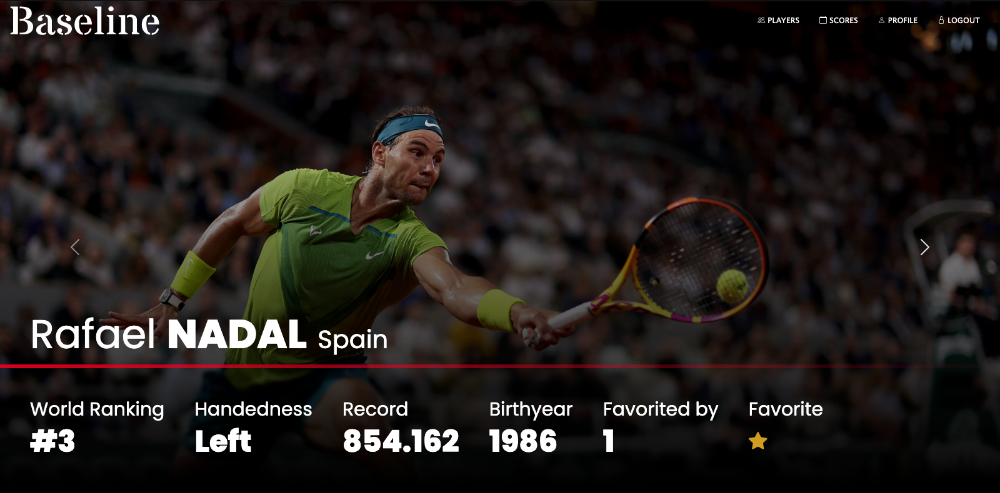

# Baseline Today

*A full-stack forum for professional tennis created with Python Flask, Bootstrap 5 and SportRadar API*

##<a href="https://www.youtube.com/watch?v=-epCZqByyrY&ab_channel=BrandonTaylor">YouTube Demo</a>

## Features

- Rankings and information of top 100 men and women pro tennis players grabbed from SportRadar API
- Live, completed, and upcoming scores of tennis matches all over the world
- Live search functionality for both players and matches
- Individual player reports, including player match histories
- Ability for logged in users to 'favorite' players to keep up with them

## Scores Demo

