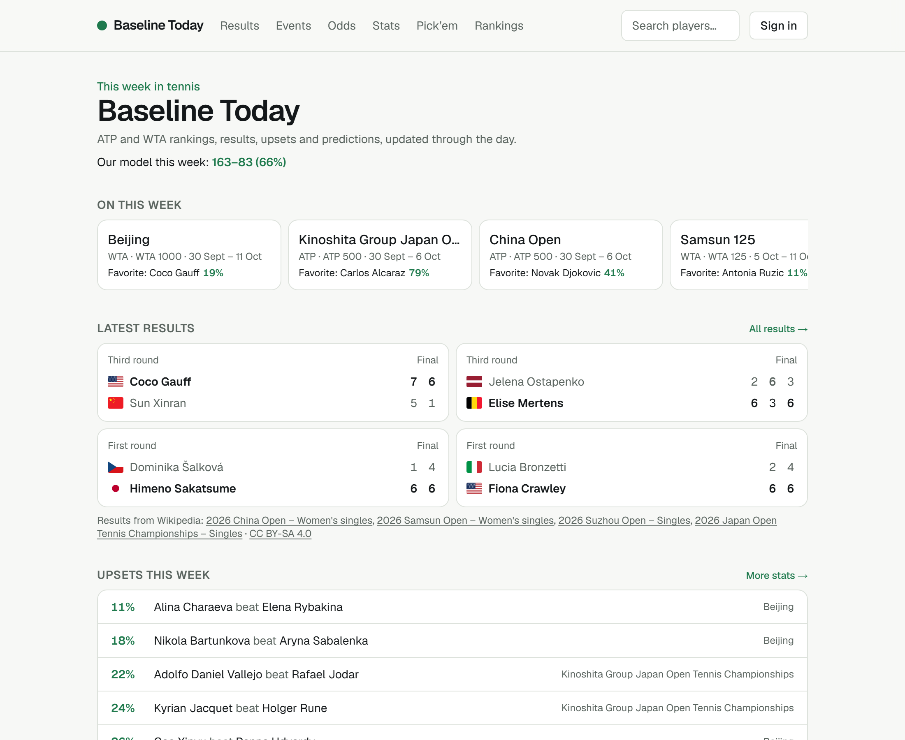
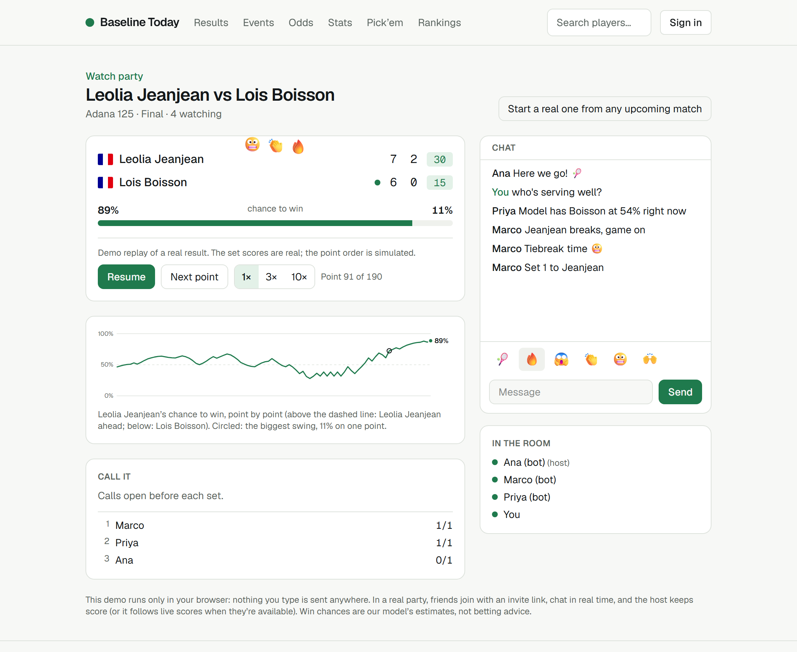
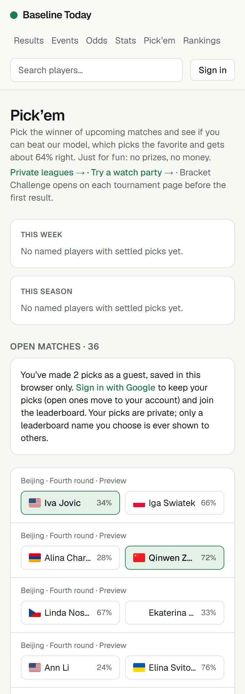

# Baseline Today

ATP and WTA tennis: rankings, results, player pages, a win-probability model, title chances for
every draw, and games to play with friends (Pick'em, Bracket Challenge, private leagues, watch
parties). A ground-up rebuild of my 2022 Flask tennis forum, built on Next.js and Supabase.

**Live:** [baseline-today.vercel.app](https://baseline-today.vercel.app) · [](https://github.com/brandontaylor156/baseline-today/actions/workflows/ci.yml)

**Try it without signing in:**
[watch party demo](https://baseline-today.vercel.app/party/demo) (a simulated replay built from a
real result's set scores, with win chances, calls and chat) ·
[Pick'em](https://baseline-today.vercel.app/pickem) (guest picks move into your account if you sign in) ·
[sample league](https://baseline-today.vercel.app/leagues) ·
[title chances](https://baseline-today.vercel.app/tournaments) ·
[week in tennis](https://baseline-today.vercel.app/week) ·
[open data](https://baseline-today.vercel.app/data) ·
[how it's built](https://baseline-today.vercel.app/about) ·
[status](https://baseline-today.vercel.app/status)

<p>
  
  
</p>
<p>
  
  
</p>
<p>
  
  
  
</p>

## What's in it

**Tennis data**
- **Rankings** (top 100 per tour) with movement, flags and stored weekly snapshots; **player pages**
  with a credited Wikimedia Commons photo, ranking history chart, season timeline, splits by
  surface, tiebreaks and deciding sets, and model rating history.
- **Results** from Wikipedia draw pages, usually within half an hour, back to 2015 (52,000+
  matches). **Tournament pages** with every match by round, the calendar, and recent champions.
- **Head-to-head** for any two players, **stats** leaderboards and biggest upsets, **countries**,
  the **season race** to the Finals, and accent-insensitive **search** ("djokovic" finds Đoković).

**The model**
- A surface-aware Elo model calibrated on the previous season (about 63% of 2026 matches called
  correctly), with a public **track record** and calibration table.
- **Title chances** for every tournament in progress, computed exactly over the bracket read off the
  draw page. The interactive draw lets you tap "what if" winners and watch every chance update.
- A point-level model that turns a live score into a win chance and reproduces the pre-match chance
  at 0-0. It powers watch parties and, on a paid data plan, live scores.

**Games** (Google sign-in; picks and entries are private and locked by row level security)
- **Pick'em** with weekly and season leaderboards compared against the model, streaks and badges.
  Visitors can play as guests; open picks move into their account when they sign in.
- **Bracket Challenge**: fill a whole draw before the first result, scored by the server.
- **Private leagues** joined by invite code with nicknames only. Signed-out visitors see a sample
  league of four strategy bots (favorite, coin flip, alphabetical, underdog) scored on this
  season's real results.
- **Watch parties**: private rooms with real-time chat and reactions over private Supabase Realtime
  channels (never stored), the host's point-by-point scorekeeping or live data, a momentum chart and
  per-set "call it" predictions. The **demo** is a simulated replay: only the set scores are real. The
  point order is simulated (and checked to replay to exactly those scores), so the win chance and
  momentum chart are simulated too, and the page says so.

**Weekly recaps and open data**
- **Week in tennis** (`/week/<monday>`): a page for every week with the champions and finals,
  the biggest upsets, ATP and WTA ranking movers and the model's record, generated from the data.
- **Open data** (`/data`): every result since 2015 and the model ratings as CSV or JSON, under
  Wikipedia's CC BY-SA 4.0 (rankings are excluded: the provider's terms don't allow it).
- **RSS** (`/feed.xml`) of results and weekly recaps.

**Getting found**
- Readable head-to-head addresses (`/h2h/jannik-sinner-vs-carlos-alcaraz-<id>-<id>`) for 1,200+
  top-100 rivalries in the sitemap; old query links redirect to them.
- schema.org structured data on player (Person), match and tournament (SportsEvent) pages, and a
  site search action.
- IndexNow pings (Bing and others) for the pages that changed each day, and optional Google and
  Bing site verification.
- A Bluesky bot posts the upset of the day and the weekly recap with share cards (off until an
  account is connected).

**Sharing and integrations**
- Match preview and result pages, share images for players, head-to-heads and matches, iCalendar
  feeds per player and per tour, and embeddable widgets.
- A Discord bot, a daily digest to Discord or Slack, and opt-in web push when a favorite finishes
  a match. These stay off until keys are set (see [Optional switches](#optional-switches)).
- An installable app (manifest, offline page, a service worker that caches only build assets).

## How it works

```
BALLDONTLIE API ─┐                                                ┌─▶ Next.js pages (data cache)
Wikidata/Commons ┴─ daily Vercel Cron ──────┐                     │
                                            ├─▶ Supabase Postgres ┤
Wikipedia draws ─── Supabase cron, 10 min ──┘   (RLS everywhere)  └─▶ browser: favorites, picks,
                                                                      leagues, parties (RLS)
```

- **Page visits never call a data provider.** Background jobs copy rankings, profiles, photos and
  results into Postgres behind database locks; pages read Postgres through Next's data cache, and
  the jobs revalidate it after each change.
- **The provider is swappable:** all BALLDONTLIE code lives in `src/lib/provider/` behind our own
  types, so pages and the database never see its response format.
- **Results from Wikipedia:** each tournament is matched to its draw page by title, tour and draw
  size; a bracket parser reads finished matches; a result shows only after its page has been
  unchanged for 10 minutes; results that vanish from the page are hidden; and an audit flags results
  taken from the wrong page. Only pages with new revisions are downloaded.
- **Row level security everywhere:** tennis data is public-read and writable only with the server's
  secret key. Favorites, picks, brackets, league and party membership are owner- or member-only;
  public numbers (favorite counts, leaderboards) come from `security definer` functions that return
  aggregates and never reveal who.
- **Operations:** [`/status`](https://baseline-today.vercel.app/status) shows when each job last
  succeeded and how fresh the data is. Failures and recoveries post to a chat webhook, and the daily
  job checks that the 10-minute results job is still running.
- **Privacy:** Google sign-in only (no passwords, no email sending). Page views and speed come from
  Vercel Web Analytics and Speed Insights, which are cookieless.
- **Auth:** `@supabase/ssr` with session refresh in `proxy.ts` and `getClaims()` verification.
  Signed-in UI is a client island, so pages stay cacheable.

## Tests

| Layer | What | Where |
| --- | --- | --- |
| Unit (Vitest) | 229 tests: provider mapping, Wikipedia parsing, Elo and title-chance math, the live model, scorekeeping, bracket scoring, the demo replay, job health, slugs, structured data, CSV export, Bluesky facets | `src/**/*.test.ts` |
| Browser (Playwright) | 47 flows on desktop and mobile: every page type, 404s, no sideways scroll, signed-out flows, guest Pick'em, the demo party, canonical redirects, structured data, downloads and feeds, cron auth | `e2e/site.spec.ts` |
| Accessibility | axe (WCAG 2.2 AA) on 17 pages in light and dark mode, desktop and mobile | `e2e/a11y.spec.ts` |
| Database | 55 row level security checks: cross-user reads and writes for every user table, locked picks and brackets, league and party membership, the realtime channel check, anon access | `supabase/tests/isolation.sql` |
| Realtime | two throwaway accounts in a real watch party: live score, chat and reactions reach the guest | `scripts/party-ui-test.mts` |

CI runs the first four on every push; the database tests run against a throwaway local Supabase
built from the repo's migrations.

## Optional switches

Everything below is off until its variables are set in Vercel (production):

| Feature | Variables | Notes |
|---|---|---|
| Result notifications | `VAPID_PUBLIC_KEY`, `VAPID_PRIVATE_KEY` | `node scripts/push-keys.mjs` writes both |
| Discord bot | `DISCORD_PUBLIC_KEY`, plus `DISCORD_APP_ID` and `DISCORD_BOT_TOKEN` locally for `node scripts/discord-register.mjs` | Interactions URL: `/api/discord` |
| Daily digest | `DIGEST_WEBHOOK_URLS` (comma-separated Discord or Slack webhook URLs) | Sent after the daily sync |
| Job failure alerts | `OPS_WEBHOOK_URLS` (falls back to `DIGEST_WEBHOOK_URLS`) | On failure and recovery |
| Bluesky bot | `BLUESKY_HANDLE`, `BLUESKY_APP_PASSWORD` (an app password) | `npm run bluesky:preview` shows today's posts |
| Search engine verification | `GOOGLE_SITE_VERIFICATION`, `BING_SITE_VERIFICATION` | Codes from Search Console / Bing Webmaster Tools |
| Live scores and in-match win chance | `LIVE_SCORES_ENABLED=1` | Paid BALLDONTLIE plan (or its trial) |
| Bookmaker odds and odds movement | `ODDS_ENABLED=1` | BALLDONTLIE GOAT plan |
| AI recaps of finals and semifinals | `ANTHROPIC_API_KEY`, `RECAPS_ENABLED=1`, `RECAPS_DAILY_LIMIT` (default 10) | Claude Haiku; labelled as AI-written |

## Stack

Next.js 16 (App Router) · React 19 · TypeScript · Tailwind CSS 4 · Supabase (Postgres, Auth,
Realtime, cron) · Vercel (Hobby, Cron, Web Analytics) · Vitest · Playwright · axe · GitHub Actions

## Development

```bash
npm install
cp .env.example .env.local     # then fill in the values
npm run dev
```

| Command | |
| --- | --- |
| `npm run typecheck` · `lint` · `test` · `build` | the same checks as CI |
| `npm run test:e2e` | Playwright against `npm run build` output (set `E2E_BASE_URL` to test a deployment) |
| `npm run sync:daily` | run the daily sync locally |
| `npm run sync:photos -- 200` | backfill Wikimedia photos |
| `npm run sync:results [-- backfill 2026 | relink]` | refresh Wikipedia results, import a season, or relink players |
| `npm run sync:rankings-history -- 2025-01-01` | backfill weekly rankings |
| `npm run sync:tournaments -- 2025` | store a season’s calendar |
| `npm run audit:draws` | re-check every tournament → draw page pairing (`--fix` to hide and rediscover) |
| `npm run model:backtest` | score the model on a held-out season |
| `npm run bluesky:preview` | print what the Bluesky bot would post today (posts nothing) |

Database schema: `supabase/migrations/` (idempotent SQL). Live scores depend on a paid data plan
and are being evaluated (see [PLAN.md](PLAN.md) and [docs/trial-runbook.md](docs/trial-runbook.md)).

## Credits

Rankings and player data from [BALLDONTLIE](https://www.balldontlie.io). Match results from
[Wikipedia](https://en.wikipedia.org/) draw pages under
[CC BY-SA 4.0](https://creativecommons.org/licenses/by-sa/4.0/), linked wherever they appear.
Not affiliated with the ATP or WTA. Player photos from Wikimedia Commons, credited on each page and at `/credits`. Flags from
[flag-icons](https://github.com/lipis/flag-icons) (MIT).
