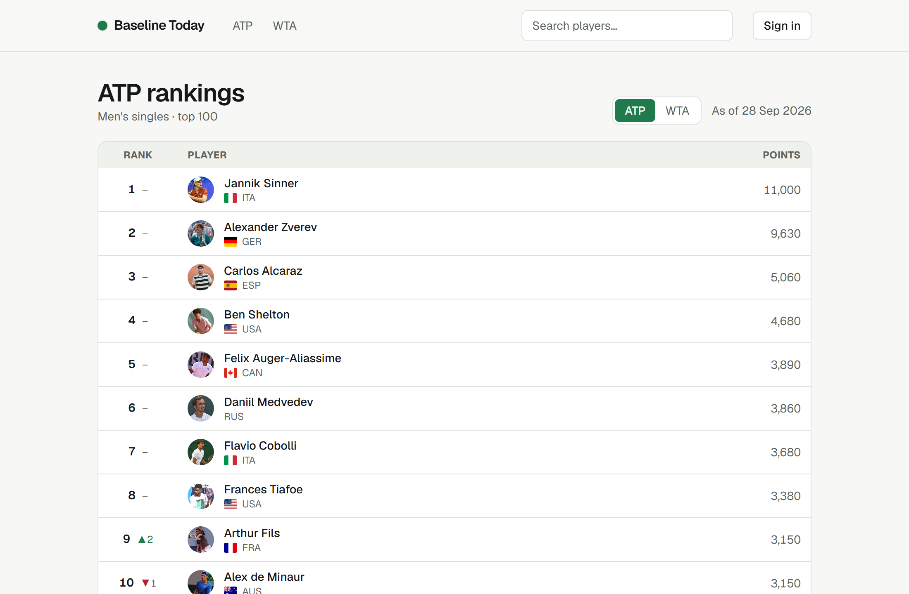
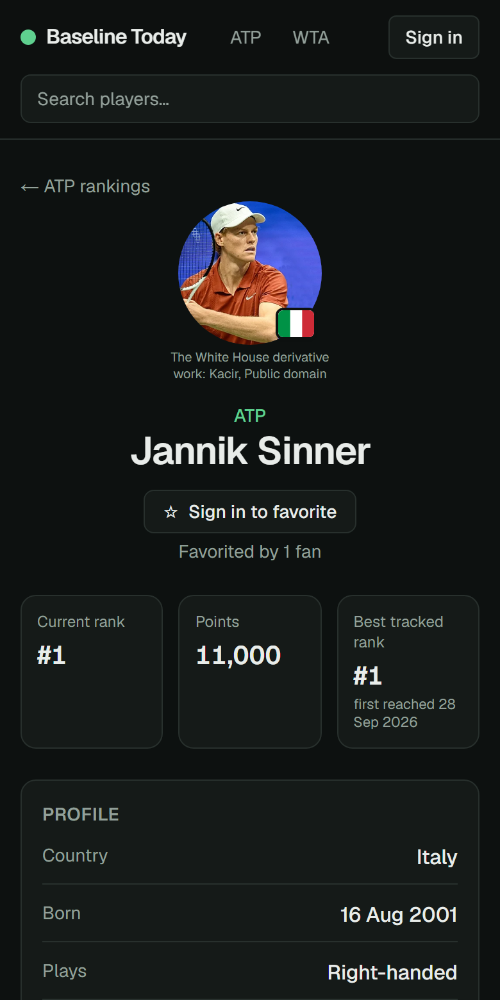
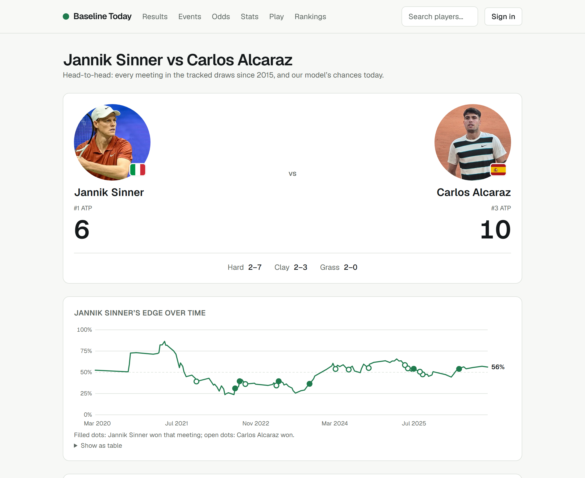
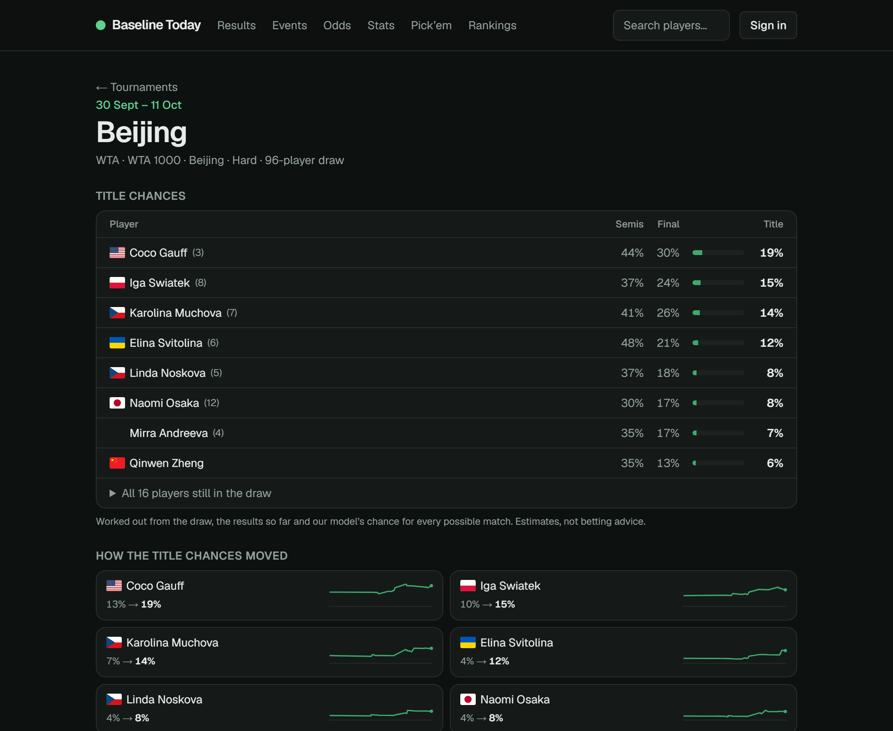
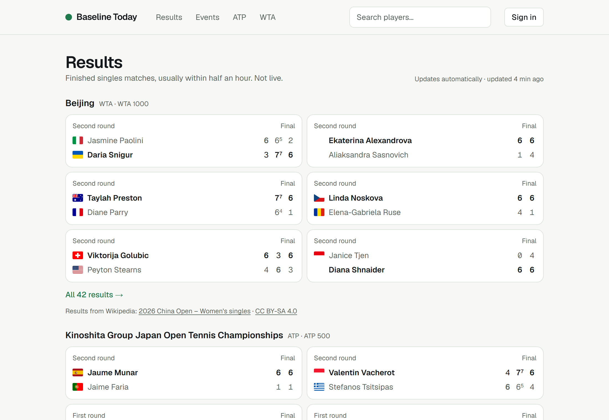

# Baseline Today

ATP and WTA singles rankings, recent match results, tournament pages, head-to-head records, and
player profiles with ranking history, season records and credited photos, plus accent-insensitive
search and favorites with Google sign-in. A ground-up rebuild of my 2022 Flask tennis forum.

**Live:** [baseline-today.vercel.app](https://baseline-today.vercel.app) · [](https://github.com/brandontaylor156/baseline-today/actions/workflows/ci.yml)

<p>
  
  
</p>
<p>
  
  
  
</p>

## Features

- **Rankings:** top 100 per tour with movement, country flags and a selector over stored weekly snapshots.
- **Player pages:** profile, current and best tracked rank, favorite count, and a freely licensed
  Wikimedia Commons photo with author and license, or an initials-and-flag avatar.
- **Results:** finished matches from the last few days, usually within half an hour, read from
  Wikipedia draw pages (credited, CC BY-SA 4.0) with plausibility and stability checks.
- **Season records:** each player’s win-loss and recent results from this season’s tracked draws.
- **Ranking history:** weekly rank since January 2025 as an accessible chart (crosshair, arrow keys,
  table view), from a one-off backfill of historical rankings.
- **Tournaments:** this week, coming up, recent champions, the full calendar, and a page per event
  with every finished match by round.
- **Head-to-head:** any two players from the same tour: record, split by surface, every meeting
  since 2024 (16,000+ matches imported across three seasons).
- **This week:** the homepage shows events in play, latest results, upsets, biggest ranking movers
  and both top 10s.
- **Predictions and odds:** a surface-aware Elo model (calibrated on the previous season; about 63%
  of 2026 matches called correctly) gives win chances for upcoming pairings and any head-to-head.
  With a paid odds plan it compares bookmakers: best price, margin-free market chance and the
  model's edge. Labeled as estimates, not betting advice, with 18+ and problem-gambling help.
- **Stats:** season leaderboards (wins, win rate, titles, comebacks, tiebreaks), the biggest upsets
  by pre-match model chance, and per-player splits by surface, tiebreaks, deciding sets and form.
- **Model ratings:** the Elo table for active players (all courts or by surface), who the model
  rates well above or below their ranking, and a calibration table showing how often favorites won.
- **Up next:** model win chances for scheduled matches on each tournament page and for your
  favorites on "My players".
- **Season timeline:** each player's tournaments this season: round reached, who stopped them, W-L.
- **Rank race:** both players' weekly ranks on one chart on the head-to-head page.
- **Countries:** each nation's top-100 players, season record, titles and recent results.
- **Share cards:** generated preview images for players and the site.
- **Installable app:** web app manifest, icons, an offline page, and a service worker that caches
  only build assets (never pages or API responses).
- **Result notifications:** opt-in web push when a favorite finishes a match (also on iPhone once
  the site is added to the Home Screen).
- **Search:** live suggestions as you type; "djokovic", "Đoković" and "DJOKOVIĆ" all match.
- **Favorites and "My players":** Google sign-in only. No passwords and no email sign-up, so nobody can
  use the site to send email.
- Mobile-first, dark mode, server rendered, keyboard and screen-reader friendly.

Live scores depend on a paid data plan and are being evaluated (see [PLAN.md](PLAN.md) and
[docs/trial-runbook.md](docs/trial-runbook.md)).

## How it works

```
BALLDONTLIE API ──┐                      ┌── Next.js pages (cached, ISR)
Wikidata/Commons ─┼─ daily Vercel Cron ─▶ Supabase Postgres ◀─┤
                  │   (1 run, ~4 calls)   (RLS on every table)└── browser: favorites (RLS)
```

- **Page visits never call the data provider.** A daily cron job stores a dated rankings snapshot,
  refreshes stale profiles (100 per request), and rechecks ~40 players' photos, all behind a database
  lock. Pages read Supabase through Next's data cache, and the job revalidates it after each sync.
- **The provider is swappable:** all BALLDONTLIE code lives in `src/lib/provider/` behind our own
  types, so pages and the database never see its response format.
- **Row level security:** tennis data is public-read and writable only by the server's secret key.
  `favorites` and `profiles` are owner-only. Favorite counts come from a `security definer` function
  that returns a number and never reveals who favorited.
- **Results from Wikipedia:** each tournament is matched to its draw page by title (distinctive
  words or a curated alias), tour (WTA vs ATP mentions) and draw size; a bracket parser reads
  finished matches; a result shows only after its page has been unchanged for 10 minutes, and
  results that disappear from the page are hidden. A Supabase cron job checks every 10 minutes and
  downloads only pages with new revisions.
- **Notifications:** `push_subscriptions` is owner-only and saved through a `security definer`
  function keyed on `auth.uid()`. After each results check, newly confirmed results are claimed
  atomically (`notified_at`) and sent with VAPID keys from `scripts/push-keys.mjs`, so overlapping
  runs never notify twice. Results older than a day are never pushed.
- **Search:** a generated `search_name` column (`unaccent`, with Đ→dj) plus a trigram index, queried
  through an RPC that ranks prefix matches first.
- **Auth:** `@supabase/ssr` with session refresh in `proxy.ts` (skipped for visitors without a
  session) and `getClaims()` verification. Signed-in UI is a client island, so pages stay cacheable.

## Stack

Next.js 16 (App Router) · React 19 · TypeScript · Tailwind CSS 4 · Supabase (Postgres, Auth) ·
Vercel (Hobby, Cron) · Vitest · Playwright · GitHub Actions

## Tests

| Layer | What | Where |
| --- | --- | --- |
| Unit (Vitest) | provider mapping, sync rows, formatting, flags, Wikimedia parsing, redirects | `src/**/*.test.ts` |
| Browser (Playwright) | rankings, 404s, no horizontal scroll at 360px, player pages, credits, search, signed-out flows, cron auth (desktop + mobile) | `e2e/` |
| Database | 15 RLS checks: cross-user favorites and profiles, anon access, write protection, sync lock | `supabase/tests/isolation.sql` |

CI runs all of them on every push. The isolation test runs against a throwaway local Supabase with
the repo's migrations.

## Development

```bash
npm install
cp .env.example .env.local     # then fill in the values
npm run dev
```

| Command | |
| --- | --- |
| `npm run typecheck` · `lint` · `test` · `build` | the same checks as CI |
| `npm run test:e2e` | Playwright against `npm run build` output (set `E2E_BASE_URL` to test a deployment) |
| `npm run sync:daily` | run the daily sync locally |
| `npm run sync:photos -- 200` | backfill Wikimedia photos |
| `npm run sync:results [-- backfill 2026 | relink]` | refresh Wikipedia results, import a season, or relink players |
| `npm run sync:rankings-history -- 2025-01-01` | backfill weekly rankings |
| `npm run sync:tournaments -- 2025` | store a season’s calendar |
| `npm run audit:draws` | re-check every tournament → draw page pairing (`--fix` to hide and rediscover) |

Database schema: `supabase/migrations/` (idempotent SQL).

## Credits

Rankings and player data from [BALLDONTLIE](https://www.balldontlie.io). Match results from
[Wikipedia](https://en.wikipedia.org/) draw pages under
[CC BY-SA 4.0](https://creativecommons.org/licenses/by-sa/4.0/), linked wherever they appear.
Not affiliated with the ATP or WTA. Player photos from Wikimedia Commons, credited on each page and at `/credits`. Flags from
[flag-icons](https://github.com/lipis/flag-icons) (MIT).
